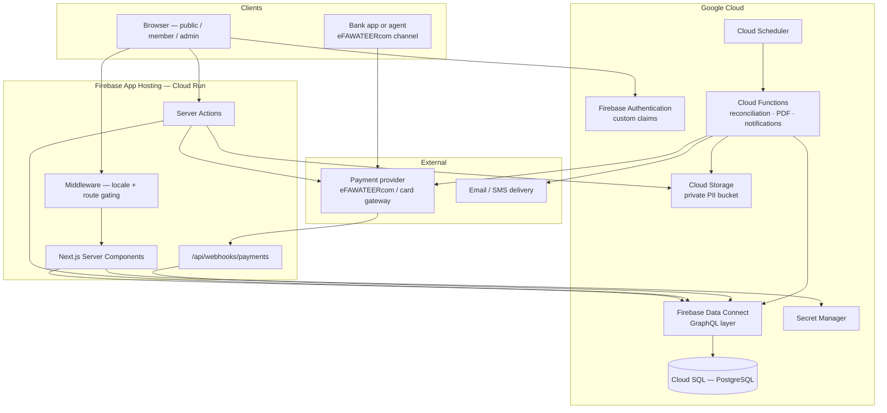

# 02 — System Architecture

## 1. Shape of the system

A single Next.js application on Firebase App Hosting, backed by managed PostgreSQL through Firebase Data Connect. There is no separate API service — server components, server actions, and a small number of route handlers *are* the backend.



## 2. Why these choices

**Next.js App Router over an SPA.** The public site needs SEO — news articles and the member directory must be indexable, and the directory is the highest-value public surface. Server rendering also keeps payment credentials and admin authorization decisions on the server, where they belong.

**Firebase Data Connect over Firestore.** This system's core is financial: invoices, line items, payments, reconciliation, and reports. That work wants JOINs, foreign keys, transactions, and constraints. Data Connect gives real PostgreSQL while keeping Firebase Auth integration, generated typed SDKs, and declarative row-level authorization. Firestore would have forced denormalization onto exactly the data least tolerant of it.

**App Hosting over raw Cloud Run.** Google manages the Next.js build, the runtime, and secret injection. Choose raw Cloud Run only if a compliance requirement demands VPC or networking control that App Hosting cannot express.

**Cloud Functions for asynchronous work only.** PDF generation, notification fan-out, scheduled invoice runs, and payment reconciliation are background jobs. Everything request-scoped stays in the Next.js runtime.

## 3. Request paths

### 3.1 Public page render
`Browser → Middleware (locale negotiation) → Server Component → Data Connect (public @auth) → PostgreSQL`
Cached with ISR. Content changes in the CMS trigger revalidation by tag.

### 3.2 Member action
`Browser → Server Action → verify session + claims → permission check → Data Connect (auth.uid-bound) → PostgreSQL`
Three independent authorization layers; see §5.

### 3.3 Payment
```
Member clicks Pay
  → Server Action recomputes the amount from the invoice in the DB
  → PaymentProvider.createBill(invoice)
  → payment_attempt row written (status: pending)
  → member redirected to provider, or given an eFAWATEERcom bill number
  ... time passes; the member may pay through a bank app ...
  → provider POSTs to /api/webhooks/payments
  → signature verified BEFORE parsing
  → raw payload persisted to payment_webhooks
  → idempotency check on provider event id
  → invoice + payment updated in one transaction
  → receipt generation queued
```
The webhook is the only trusted source of payment truth. A redirect back from the provider is a UI hint, never a state change.

### 3.4 Scheduled work
`Cloud Scheduler → Cloud Function → Data Connect`
Jobs: nightly payment reconciliation, renewal reminder sweep, overdue invoice marking, annual invoice run, expired-certificate sweep.

## 4. Data layer

**Source of truth:** `dataconnect/schema/schema.gql`. Postgres schema is derived from it, never hand-edited.

**Operations** live in `dataconnect/connector/*.gql`, grouped by domain: `members`, `finance`, `content`, `services`, `admin`. Each declares an `@auth` level. The generated SDK is the only database interface the application code sees.

**Migration flow:** edit schema → regenerate SDK → **human reviews the generated SQL** → apply dev → staging → prod. Destructive migrations (drop column, narrow type) require an explicit two-step: deploy code that stops using the column, then drop it in a later release.

## 5. Authorization — three layers

| Layer | Enforces | Failure mode if it alone is bypassed |
|---|---|---|
| **Middleware** | Route access by role claim | User reaches a page shell but sees no data |
| **Server action / RSC** | Operation-level permission | Request rejected before touching the database |
| **Data Connect `@auth`** | Row-level ownership and role predicates | Query returns nothing, even if called directly |

No single layer is trusted. A member requesting another member's invoice fails at layer 3 even if layers 1 and 2 were somehow bypassed.

Roles are Firebase Auth **custom claims** for cheap edge gating, and are **mirrored into Postgres** so permission data is joinable in queries and reports. The mirror is written by a single server-side function; claims and rows never diverge because they are set together.

## 6. File storage

Two buckets:

| Bucket | Contents | Access |
|---|---|---|
| `asoo-public` | Logos, news images, published legal documents, forms | Public read via CDN |
| `asoo-private` | License scans, national IDs, complaint attachments, issued certificates | **No public access.** Short-lived signed URLs generated server-side after a permission check |

Uploads go through a server action that validates MIME type, size, and virus-scan status before the object is marked usable. An uploaded-but-unvalidated object is never served.

## 7. Environments

| Env | Firebase project | Database | Payments | Domain |
|---|---|---|---|---|
| local | emulator suite | local Postgres in Docker | `MockProvider` | `localhost:3000` |
| dev | `asoo-dev` | Cloud SQL (small) | `MockProvider` | `asoo-dev.web.app` |
| staging | `asoo-staging` | Cloud SQL (small) | provider sandbox | `asoo-staging.web.app`, behind auth |
| prod | `asoo-prod` | Cloud SQL (HA, PITR) | live provider | Workspace domain via App Hosting |

**No developer connects to staging or prod data.** All local work runs against the emulator suite, including the Data Connect emulator against a local Postgres instance.

### 7.1 Region — OPEN ITEM, BLOCKS PROVISIONING

There is **no Google Cloud region in Jordan**. The candidates:

| Region | Location | Consideration |
|---|---|---|
| `me-central1` | Doha, Qatar | Nearest acceptable region; lowest latency to Amman among viable options |
| `me-central2` | Dammam, Saudi Arabia | Also regionally close |
| `me-west1` | Tel Aviv, Israel | Lowest latency, but almost certainly politically unacceptable for a Jordanian government-affiliated body |
| `europe-west1/3/4` | Belgium / Frankfurt / Netherlands | GDPR-aligned, mature, higher latency (~60-80ms) |

**Region is immutable after instance creation.** Do not provision until the syndicate's legal and IT authority gives a written answer. Working assumption for planning: `me-central1`.

## 8. Observability

- **Cloud Logging** with structured JSON. National IDs, tokens, and payment credentials are redacted at the logger, not at the call site.
- **Error tracking** on server actions and webhook handlers, with alerting on webhook signature failures and illegal payment state transitions — both are attack signals, not just bugs.
- **Uptime checks** on the homepage, the directory search, and the payment webhook endpoint.
- **Business alerts:** reconciliation divergence, invoice run failure, notification delivery failure rate above threshold.

## 9. Backup and recovery

- Cloud SQL automated backups with **point-in-time recovery** enabled on prod.
- Retention: 30 days PITR, 12 monthly snapshots retained for the financial year.
- Storage buckets versioned; private bucket has a deletion-protection policy.
- **A restore drill is run before launch and documented.** An untested backup is not a backup.

## 10. Secrets

All provider credentials, signing keys, and service account keys live in **Google Secret Manager** and are injected into App Hosting at runtime. No secret is ever committed, and `.env*` files are gitignored except `.env.example`, which contains keys with empty values only.
