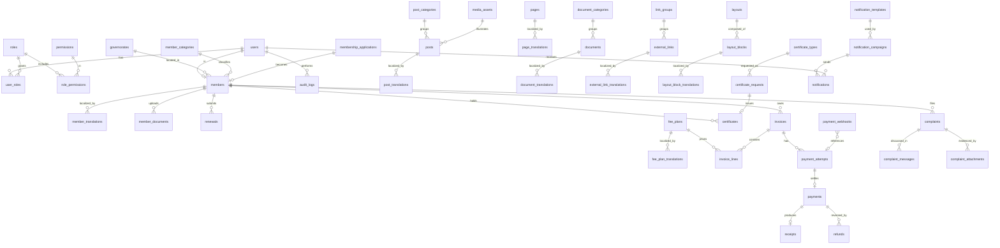

# 03 — Data Model

PostgreSQL via Firebase Data Connect. The authoritative schema lives in `dataconnect/schema/schema.gql`; this document explains the reasoning behind it.

---

## 1. Modeling rules

These apply to every table in the system.

1. **Translations are rows, not columns.** Any entity with user-facing text has a `*_translations` child table keyed by `(parent_id, locale)`. Never `title_ar` / `title_en` columns — that pattern breaks the moment a third locale appears, and it makes "list all untranslated posts" an awkward query.
2. **Financial tables are append-only.** Invoices and payments are never rewritten. A correction is a new row of type `credit_note` or `adjustment` that references the original. The original record must survive audit.
3. **Money is `BIGINT` fils.** 1 JOD = 1000 fils. No `NUMERIC`, no `FLOAT`. Currency is a separate column, always `JOD`, present so the schema does not have to change if that ever stops being true.
4. **Timestamps are `timestamptz`, stored UTC.** Display conversion to `Asia/Amman` happens in the presentation layer only.
5. **Soft delete only where history matters.** Content entities carry `deleted_at`. Financial and audit rows are never deleted, soft or otherwise.
6. **Every table has `created_at`, `updated_at`.** Every table that a human can modify also has `created_by`, `updated_by` referencing `users.id`.
7. **Enums are Postgres enums**, not free-text with a check constraint, so an invalid value is impossible rather than merely discouraged.
8. **Foreign keys are declared and enforced.** Cascade behavior is explicit and deliberate per relationship — never left to default.

---

## 2. Entity relationship overview

---

## 3. Identity and access

### `users`
Mirrors Firebase Auth. `id` is the Firebase UID (text primary key) — no surrogate key, so there is exactly one identity per person.

| Column | Type | Notes |
|---|---|---|
| `id` | `text` PK | Firebase Auth UID |
| `email` | `citext` unique | |
| `phone` | `text` | E.164, Jordanian `+962…` |
| `display_name` | `text` | |
| `preferred_locale` | `locale` enum | `ar` \| `en`, default `ar` |
| `is_active` | `boolean` | Deactivation without deletion |
| `last_login_at` | `timestamptz` | |

### `roles`, `permissions`, `role_permissions`, `user_roles`
Standard RBAC. `permissions` are `resource:action` strings (`invoices:issue`, `posts:publish`, `members:suspend`). Roles are seeded, not user-created, so the permission matrix in `docs/08-security.md` stays the single specification.

`user_roles` is many-to-many — a small syndicate will have staff holding two roles (a membership officer who also edits content).

### `audit_logs`
**Append-only. No update, no delete, ever.**

| Column | Type | Notes |
|---|---|---|
| `id` | `bigserial` PK | |
| `actor_user_id` | `text` FK | Nullable — system jobs have no actor |
| `actor_role` | `text` | Snapshot at time of action; roles change, the log must not |
| `action` | `text` | `invoice.waive`, `member.suspend`, `post.publish` |
| `entity_type` | `text` | |
| `entity_id` | `text` | |
| `before` | `jsonb` | Null on create |
| `after` | `jsonb` | Null on delete |
| `reason` | `text` | Required for waivers, suspensions, rejections |
| `ip_address` | `inet` | |
| `user_agent` | `text` | |
| `created_at` | `timestamptz` | |

Indexed on `(entity_type, entity_id)`, `(actor_user_id, created_at)`, and `created_at`.

---

## 4. Membership

### `governorates`
The 12 Jordanian governorates, seeded, with AR/EN names: Amman, Irbid, Zarqa, Aqaba, Mafraq, Jerash, Madaba, Karak, Tafilah, Ma'an, Ajloun, Balqa. Seeded reference data, not user-editable.

### `member_categories`
Membership class — e.g. office owner, practicing surveyor, associate, honorary. Drives fee plan selection and directory presentation. Seeded, with translations.

### `members`

| Column | Type | Notes |
|---|---|---|
| `id` | `uuid` PK | |
| `user_id` | `text` FK unique | Nullable until the member claims their account |
| `license_number` | `text` unique | The DLS-issued license, the public identifier |
| `membership_number` | `text` unique | Syndicate's own number |
| `category_id` | FK | |
| `governorate_id` | FK | |
| `status` | `member_status` enum | `pending` \| `active` \| `suspended` \| `expired` \| `withdrawn` \| `deceased` |
| `joined_at` | `date` | |
| `license_expires_at` | `date` | |
| `national_id` | `text` | **PII.** Encrypted at rest, never in a query result outside the member's own record or a membership officer's view |
| `phone`, `email` | | Contact of record |
| `is_directory_visible` | `boolean` | Member consent to appear publicly |
| `directory_phone`, `directory_email`, `directory_address` | | Separate from contact-of-record so a member can publish a work number without publishing their personal one |

`member_translations` holds `full_name`, `office_name`, `bio`, `specializations[]` per locale.

**`status` drives two behaviors:** public directory visibility (`active` only, and only with consent) and dashboard capability gating. Both derive from this one column — there is no second flag that can drift out of sync.

### `member_documents`
License scans, national ID copies, qualification certificates. Stored in the **private** bucket. Row records `storage_path`, `document_type`, `verified_by`, `verified_at`, `expires_at`. Never exposed by public URL.

### `membership_applications`
The public join form. Carries applicant details and uploaded documents, moves through `submitted → under_review → info_requested → approved → rejected`, and on approval creates the `members` row. Kept permanently — a rejected application is part of the record.

### `renewals`
One row per member per membership year. `status`: `draft → submitted → under_review → approved | rejected`. Links to the invoice it generates and the documents submitted with it. A member cannot have two open renewals for the same year — enforced by a unique constraint on `(member_id, membership_year)`.

---

## 5. Finance

### `fee_plans`
| Column | Notes |
|---|---|
| `code` | `ANNUAL_OFFICE_OWNER`, `ANNUAL_PRACTICING`, `LATE_PENALTY`, `CERT_GOOD_STANDING` |
| `category_id` | Nullable — some fees apply to all categories |
| `amount_fils` | `bigint` |
| `currency` | `JOD` |
| `billing_cycle` | `annual` \| `one_time` |
| `effective_from`, `effective_to` | **Fee plans are versioned by date, not edited in place.** Changing the 2026 fee creates a new row; the 2025 invoices still point at the 2025 row and still reconcile. |

### `invoices`
| Column | Notes |
|---|---|
| `invoice_number` | Human-facing, sequential per year: `ASOO-2026-000123`. Generated from a Postgres sequence — never derived from a count, which races |
| `member_id` | Nullable — a public invoice (contractor fee) has no member |
| `payer_name`, `payer_contact` | For memberless invoices |
| `type` | `subscription` \| `renewal` \| `certificate` \| `penalty` \| `service` \| `credit_note` \| `adjustment` |
| `parent_invoice_id` | Set on credit notes and adjustments, pointing at what they correct |
| `status` | `draft` \| `issued` \| `partially_paid` \| `paid` \| `overdue` \| `cancelled` \| `waived` |
| `subtotal_fils`, `discount_fils`, `total_fils` | All `bigint` |
| `issued_at`, `due_at`, `settled_at` | |
| `public_reference` | Short opaque code a payer enters on `/services/pay` to find their bill without logging in. Random, not sequential — a sequential reference would let anyone enumerate invoices |

### `invoice_lines`
`invoice_id`, `fee_plan_id` (nullable for ad-hoc lines), `description` (snapshot, so a later fee-plan rename does not rewrite history), `quantity`, `unit_amount_fils`, `line_total_fils`.

### `payment_attempts`
One row per time a payer starts a payment. Records `provider`, `provider_ref`, `bill_number` (eFAWATEERcom), `amount_fils`, `status`, `expires_at`, `initiated_by`. Multiple attempts per invoice are normal and expected — a member may abandon a payment and retry.

### `payments`
A **settled** payment only. Created by the webhook handler, never by a client. Records `invoice_id`, `attempt_id`, `provider_transaction_id` (**unique** — this is the idempotency key), `amount_fils`, `paid_at`, `channel` (`efawateercom` \| `card` \| `cash` \| `bank_transfer`), and `reconciled_at`.

Cash and bank transfer exist because members will still pay in person; those rows are created by a finance officer and carry a `recorded_by` user reference.

### `payment_webhooks`
**Immutable raw log.** `provider`, `event_id` (unique), `signature_valid`, `raw_payload` (`jsonb`), `received_at`, `processed_at`, `processing_error`. Written **before** any business logic runs, so a bug in processing never loses the provider's message.

### `receipts`
`payment_id`, `receipt_number`, `storage_path` (generated PDF), `issued_at`.

### `refunds`
`payment_id`, `amount_fils`, `reason` (required), `status`, `provider_ref`, `approved_by`. Never modifies the original payment row.

---

## 6. Content / CMS

### `posts` + `post_translations`
News and announcements. Post carries `category_id`, `slug` (unique, ASCII), `status` (`draft` \| `scheduled` \| `published` \| `archived`), `published_at`, `featured_image_id`, `is_featured`, `view_count`. Translations carry `title`, `excerpt`, `body` (rich text), `seo_title`, `seo_description`.

A post is publicly visible only when `status = published` **and** `published_at <= now()` **and** a translation exists for the requested locale. If a translation is missing, the reader gets the default locale with an explicit "not available in this language" notice — never an empty page.

### `pages` + `page_translations`
Static pages (about, board, history, contact). Same translation pattern. `is_system` marks pages that cannot be deleted because a route depends on them.

### `documents` + `document_translations` + `document_categories`
The legislation library. Categories seeded to match the existing site: **تشريعات** (legislation), **تعرفة** (tariffs), **تعليمات** (instructions), **نماذج** (forms). Each document has a `storage_path` to a real file, `file_size`, `mime_type`, `published_at`, plus optional `official_reference` (e.g. "Law 43/1972") and `external_url` for documents hosted on a government site rather than uploaded.

### `external_links` + `link_groups`
The government-service and map link cards. `link_groups` seeded as `gov_services` and `survey_maps`. Each link has `url`, `icon`, `position`, `is_active`, and translated title/description. **Admin-editable** — when a ministry launches a new portal, a content editor adds a card without a deploy.

### `media_assets`
Uploaded images with `storage_path`, dimensions, `alt_text` per locale (accessibility is not optional), and `uploaded_by`.

### `layouts` + `layout_blocks` + `layout_block_translations`
The homepage composition system. Fully specified in `docs/09-cms.md`.

- `layouts`: one per composable surface (`homepage`, plus future landing pages), with a `published_version` and a `draft_version` so an editor can compose without publishing.
- `layout_blocks`: `layout_id`, `type` (enum), `position` (integer, gap-numbered by 10 so reordering does not renumber everything), `is_published`, `config` (`jsonb`, validated against a Zod schema per block type).
- `layout_block_translations`: the text inside each block, per locale.

---

## 7. Member services

### `certificate_types`
Seeded: good-standing (حسن سيرة وسلوك), membership certificate (شهادة عضوية), no-objection letter (عدم ممانعة). Each carries `requires_approval`, `validity_days`, and an optional `fee_plan_id` — some certificates are free, some are billed.

### `certificate_requests`
`member_id`, `type_id`, `purpose` (why the member needs it — often required on the certificate itself), `status` (`submitted → under_review → approved → issued | rejected`), `reviewed_by`, `invoice_id` if billable.

### `certificates`
The issued artifact. `verification_code` (unique, random, URL-safe — this is what the QR encodes), `storage_path` to the PDF, `issued_at`, `expires_at`, `status` (`valid` \| `expired` \| `revoked`), `revoked_reason`.

The public verification endpoint at `/services/verify/[code]` returns only: whether the certificate is valid, its type, the member's public name and license number, and its issue and expiry dates. **Nothing else** — a verification page is not a data-leak surface.

### `complaints`
`complainant_member_id` (nullable — the public can complain about a member), `complainant_contact` for public complainants, `subject_member_id` (who the complaint is about, nullable), `type` (`boundary_dispute` \| `technical` \| `professional_conduct` \| `administrative` \| `other`), `status` (`submitted → triaged → in_progress → resolved → closed`), `priority`, `assigned_to`, `resolution_summary`, `resolved_at`.

`complaint_messages` is the threaded conversation, each message flagged `is_internal` so staff can leave notes the complainant never sees. `complaint_attachments` point at the **private** bucket.

---

## 8. Notifications

- `notification_templates` — `code`, `channel` (`email` \| `sms` \| `in_app`), with subject and body per locale, and a declared list of allowed merge variables so a template cannot reference a field that does not exist.
- `notification_campaigns` — `template_id`, `segment_filter` (`jsonb`: status, governorate, category, overdue-balance predicates), `scheduled_at`, `status`, `created_by`.
- `notifications` — one row per recipient per send. `user_id`, `campaign_id` (nullable for transactional sends), `channel`, `status` (`queued` \| `sent` \| `delivered` \| `failed` \| `bounced`), `provider_message_id`, `error`, `read_at`.

The per-recipient table exists so "did this member receive their renewal reminder" is answerable — which it must be, because non-payment disputes will turn on it.

---

## 9. Indexing plan

| Table | Index | Why |
|---|---|---|
| `members` | `(status, governorate_id)` | Directory filtering — the highest-traffic public query |
| `members` | GIN trigram on translated `full_name`, `office_name` | Arabic substring search; trigram handles the lack of stemming |
| `members` | `license_number` unique | Direct lookup |
| `invoices` | `(member_id, status)` | Member dashboard |
| `invoices` | `(status, due_at)` | Overdue sweep job |
| `invoices` | `public_reference` unique | Public bill lookup |
| `payments` | `provider_transaction_id` unique | **Idempotency** — this constraint is what makes webhook replay safe |
| `payment_webhooks` | `event_id` unique | Same |
| `posts` | `(status, published_at DESC)` | News feed |
| `posts` | `slug` unique | |
| `audit_logs` | `(entity_type, entity_id)`, `(actor_user_id, created_at)` | Audit queries |
| `certificates` | `verification_code` unique | Public verification |
| `layout_blocks` | `(layout_id, position)` | Homepage render |

**Arabic search note:** PostgreSQL has no built-in Arabic stemmer. Use `pg_trgm` similarity for name and office search rather than `tsvector`, and normalize on write — strip tashkeel (diacritics), unify alef forms (أ إ آ → ا), unify ta marbuta (ة → ه), and unify ya (ى → ي) into a `search_normalized` column. Without this normalization, a member typing "احمد" will not find "أحمد", which is the single most common Arabic search failure.

---

## 9a. Orders, report review & approval (Phase 2)

A surveyor uploads a technical report — **PDF, Word, or DWG** — against an
**order**, staff review it, and on approval an **approval artifact** is issued
carrying a **QR verification code** the public can scan.

| Table | Purpose | Notes |
|---|---|---|
| `orders` | A unit of survey work reports attach to | `order_number` unique, human-facing (`ORD-2026-000418`) — this is the id a member types on the upload form. Internal `id` is a random UUID |
| `report_submissions` | One uploaded report file, linked to an order | `file_type` ∈ {pdf, docx, dwg}; `storage_path` in the **private** bucket; `checksum` (SHA-256) proves the reviewed file is the issued file; a resubmission is a NEW row with `version`+1, prior marked `superseded` — history survives |
| `report_reviews` | An immutable review decision | **Append-only** — a second look is a second row. Written in the audit transaction |
| `report_approvals` | The issued approval + QR | `verification_code` unique, **random** (not derived from any sequential id — a sequential code would let anyone enumerate approvals). The public verify endpoint reads by code and returns only validity, order number, title, member name, date — never the file, never PII |

**Workflow states:** an order moves `draft → submitted → in_review →
(revision_requested ↺ | approved | rejected) → completed`. A submission moves
`uploaded → under_review → (revision_requested | approved | rejected)`, or
`superseded` when replaced.

**Indexes to add:** `report_submissions (order_id, version)`,
`report_submissions (status, created_at)` for the review queue,
`report_approvals verification_code unique` for the public lookup, and
`orders order_number unique`.

**File handling** follows the PII rules in `docs/08-security.md` §6: report
files live in the private bucket, are virus-scanned before they are servable,
and are downloaded only through short-lived signed URLs after a permission
check. DWG is a binary AutoCAD format with no reliable MIME, so the extension
plus a magic-byte check is authoritative.

**Schema integrity is gated:** `npm run audit:schema` checks every table for a
primary key, resolvable foreign-key types, `Int64` money, valid enum defaults,
snake_case names, and the append-only tables — run before any schema commit.

---

## 10. Seed data

Required before the application runs:

- 12 governorates (AR/EN)
- Member categories (AR/EN)
- Roles and the full permission set from `docs/08-security.md`
- Document categories: تشريعات · تعرفة · تعليمات · نماذج
- Link groups and the existing external links from the current site (DLS portal, Amman services, MOLA, DLS maps, RJGC, Amman Explorer, DLS surveyor registry)
- Post categories
- Certificate types
- The homepage layout with its default block set, reproducing the current site's structure
- Notification templates for renewal reminder, overdue notice, application received, application approved, certificate issued, payment receipt

Existing content — the five current news items, the five document entries, and all page copy — is captured in `design/content-inventory.md` and seeded from there.

---

## 11. Data migration (Phase 2 discovery)

Existing member records are of **unknown format and quality**. Before writing an importer, establish:

- What form the records are in (spreadsheet, legacy database, paper)
- Whether license numbers are unique and consistently formatted
- Whether Arabic names carry consistent orthography (they usually do not — hence the normalization column)
- Whether contact details are current enough to send account-claim invitations to

Plan for a **staged import**: load into a quarantine table, run validation, produce an exceptions report for the membership office to resolve by hand, then promote. Do not import directly into `members`.
