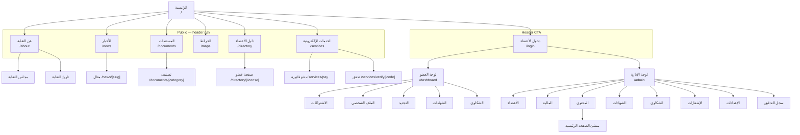

# 04 — Site Architecture

Information architecture, URL structure, navigation, and internal linking. This is the second of two documents the syndicate signs off on before implementation.

---

## 1. Routing model

Every route is locale-prefixed. There are no unprefixed content routes.

| Path | Behavior |
|---|---|
| `/` | Redirects to `/ar` or `/en` by `Accept-Language`, defaulting to `ar` |
| `/ar/*` | Arabic, `dir="rtl"` |
| `/en/*` | English, `dir="ltr"` |

The locale switcher preserves the current path and query. Switching locale on `/ar/news/some-slug` lands on `/en/news/some-slug` — slugs are locale-independent (ASCII, transliterated), so no slug translation table is needed.

Three route groups, three different shells:

```
app/[locale]/(public)/    header + mega-footer + breadcrumbs
app/[locale]/(member)/    sidebar (inline-start anchored) + status top bar
app/[locale]/(admin)/     grouped sidebar + command palette
```

---

## 2. Page hierarchy

```
Homepage  /[locale]
│
├── About                          /[locale]/about
│   ├── Board                      /[locale]/about/board
│   └── History                    /[locale]/about/history
│
├── News                           /[locale]/news
│   ├── Article                    /[locale]/news/[slug]
│   └── Category                   /[locale]/news/category/[slug]
│
├── Documents                      /[locale]/documents
│   └── Category                    /[locale]/documents/[category]
│                                   legislation · tariffs · instructions · forms
│
├── Maps & official systems        /[locale]/maps
│
├── Member directory               /[locale]/directory
│   ├── Member public page         /[locale]/directory/[licenseNumber]
│   └── By governorate             /[locale]/directory/governorate/[slug]
│
├── E-services                     /[locale]/services
│   ├── Pay a bill  (no login)     /[locale]/services/pay
│   │   └── Bill detail            /[locale]/services/pay/[reference]
│   ├── Payment result             /[locale]/services/pay/result
│   └── Verify a certificate       /[locale]/services/verify/[code]
│
├── Join the syndicate             /[locale]/join
│   └── Application status         /[locale]/join/status/[token]
│
├── Contact                        /[locale]/contact
│
├── Auth
│   ├── Login                      /[locale]/login
│   ├── Register                   /[locale]/register
│   └── Reset password             /[locale]/reset-password
│
├── Legal
│   ├── Privacy                    /[locale]/privacy
│   ├── Terms                      /[locale]/terms
│   └── Accessibility statement    /[locale]/accessibility
│
├── MEMBER DASHBOARD               /[locale]/dashboard            [auth: member]
│   ├── Subscriptions              /[locale]/dashboard/subscriptions
│   │   └── Invoice detail         /[locale]/dashboard/invoices/[id]
│   ├── Payment history            /[locale]/dashboard/payments
│   ├── Profile                    /[locale]/dashboard/profile
│   │   └── Documents              /[locale]/dashboard/profile/documents
│   ├── Renewal                    /[locale]/dashboard/renewal
│   ├── Certificates               /[locale]/dashboard/certificates
│   │   └── New request            /[locale]/dashboard/certificates/request
│   ├── Complaints                 /[locale]/dashboard/complaints
│   │   ├── New                    /[locale]/dashboard/complaints/new
│   │   └── Detail                 /[locale]/dashboard/complaints/[id]
│   └── Notifications              /[locale]/dashboard/notifications
│
└── ADMIN DASHBOARD                /[locale]/admin                 [auth: staff]
    ├── Applications               /[locale]/admin/applications
    │   └── Detail                 /[locale]/admin/applications/[id]
    ├── Members                    /[locale]/admin/members
    │   ├── Detail                 /[locale]/admin/members/[id]
    │   └── Import                 /[locale]/admin/members/import
    ├── Renewals                   /[locale]/admin/renewals
    ├── Finance                    /[locale]/admin/finance
    │   ├── Fee plans              /[locale]/admin/finance/plans
    │   ├── Invoices               /[locale]/admin/finance/invoices
    │   │   ├── Detail             /[locale]/admin/finance/invoices/[id]
    │   │   └── Bulk run           /[locale]/admin/finance/invoices/bulk
    │   ├── Payments               /[locale]/admin/finance/payments
    │   ├── Reconciliation         /[locale]/admin/finance/reconciliation
    │   └── Reports                /[locale]/admin/finance/reports
    ├── Content                    /[locale]/admin/content
    │   ├── News                   /[locale]/admin/content/news
    │   │   └── Editor             /[locale]/admin/content/news/[id]
    │   ├── Pages                  /[locale]/admin/content/pages
    │   ├── Documents              /[locale]/admin/content/documents
    │   ├── External links         /[locale]/admin/content/links
    │   ├── Media library          /[locale]/admin/content/media
    │   └── Homepage composer      /[locale]/admin/content/homepage
    ├── Certificates               /[locale]/admin/certificates
    ├── Complaints                 /[locale]/admin/complaints
    │   └── Detail                 /[locale]/admin/complaints/[id]
    ├── Notifications              /[locale]/admin/notifications
    │   ├── Templates              /[locale]/admin/notifications/templates
    │   └── Campaigns              /[locale]/admin/notifications/campaigns
    ├── Settings                   /[locale]/admin/settings
    │   ├── Roles                  /[locale]/admin/settings/roles
    │   ├── Staff users            /[locale]/admin/settings/users
    │   └── Reference data         /[locale]/admin/settings/reference
    └── Audit log                  /[locale]/admin/audit
```

Depth check: every public page is reachable within **3 clicks** of the homepage. The deepest public route, a member's public page, is Home → Directory → Member.

---

## 3. Visual sitemap



---

## 4. URL map

| Page | URL | Parent | Nav location | Auth | Priority |
|---|---|---|---|---|---|
| Homepage | `/[locale]` | — | Logo | public | High |
| About | `/[locale]/about` | Home | Header | public | High |
| Board | `/[locale]/about/board` | About | Footer | public | Low |
| History | `/[locale]/about/history` | About | Footer | public | Low |
| Directory | `/[locale]/directory` | Home | Header | public | **High** |
| Member page | `/[locale]/directory/[license]` | Directory | Contextual | public | High |
| By governorate | `/[locale]/directory/governorate/[slug]` | Directory | Facet + footer | public | Medium |
| E-services | `/[locale]/services` | Home | Header | public | High |
| Pay a bill | `/[locale]/services/pay` | Services | Header + footer | public | **High** |
| Verify certificate | `/[locale]/services/verify/[code]` | Services | QR / direct | public | Medium |
| Maps | `/[locale]/maps` | Home | Header | public | Medium |
| Documents | `/[locale]/documents` | Home | Header | public | High |
| Document category | `/[locale]/documents/[category]` | Documents | In-page tabs | public | Medium |
| News | `/[locale]/news` | Home | Header | public | High |
| Article | `/[locale]/news/[slug]` | News | Contextual | public | Medium |
| News category | `/[locale]/news/category/[slug]` | News | In-page filter | public | Low |
| Join | `/[locale]/join` | Home | Footer + About CTA | public | High |
| Contact | `/[locale]/contact` | Home | Footer | public | Medium |
| Login | `/[locale]/login` | Home | **Header CTA** | public | High |
| Member dashboard | `/[locale]/dashboard` | — | Post-login | member | High |
| Admin dashboard | `/[locale]/admin` | — | Post-login | staff | High |

---

## 5. Navigation specification

### 5.1 Public header

Seven items plus a CTA — at the upper bound of the 4–7 guideline, justified because each maps to a distinct user intent and the current site already trains users on this set.

| Order (RTL: right → left) | Arabic | English | Target |
|---|---|---|---|
| 1 | الرئيسية | Home | `/[locale]` |
| 2 | عن النقابة | About | `/[locale]/about` |
| 3 | دليل الأعضاء | Directory | `/[locale]/directory` |
| 4 | الخدمات الإلكترونية | E-Services | `/[locale]/services` |
| 5 | الخرائط | Maps | `/[locale]/maps` |
| 6 | المستندات | Documents | `/[locale]/documents` |
| 7 | الأخبار | News | `/[locale]/news` |

**Right of the nav (LTR end):** locale switcher `AR / EN`, then the primary CTA **`دخول الأعضاء` / `Member Login`**. Once authenticated, the CTA becomes an avatar menu with *Dashboard · Profile · Sign out*.

**Changes from the current site, and why:**
- `البحث عن الأعضاء` (*search for members*) → `دليل الأعضاء` (*member directory*). A directory is a destination; a search is an action. The new name sets the right expectation and reads better as a nav label.
- `تشريعات` removed from the header. It currently points off-site to the DLS legislation page, which breaks the user's session unexpectedly. It moves inside `/documents` as a category, alongside a clearly-marked external link.
- `الخدمات الإلكترونية` added. Bill payment is the system's core new capability and must be reachable in one click.
- `اتصل بنا` moves to the footer to make room. Contact is a low-frequency destination and is already prominent in the footer of every government portal.

**Mobile:** a drawer opening from the inline-start edge (right in Arabic). The **Pay a bill** and **Login** actions stay visible outside the drawer — they are the two things a member on a phone actually came for.

### 5.2 Footer

Four columns. In RTL they read right to left; the CSS uses logical properties so no separate rule is needed.

| النقابة | الخدمات | المحتوى | قانوني |
|---|---|---|---|
| عن النقابة | دفع فاتورة | الأخبار | سياسة الخصوصية |
| مجلس النقابة | التحقق من شهادة | المستندات | شروط الاستخدام |
| تاريخ النقابة | طلب عضوية | الخرائط | بيان إمكانية الوصول |
| اتصل بنا | دخول الأعضاء | دليل الأعضاء | |

Below the columns: address in Amman, phone, email, the twelve governorate directory links (an SEO surface and a genuine user shortcut), and the copyright line.

### 5.3 Member sidebar

Anchored to the **inline-start** edge — right in Arabic, left in English. Collapsible to icons on tablet, a bottom sheet on mobile.

`نظرة عامة` · `الاشتراكات والفواتير` · `سجل المدفوعات` · `ملفي الشخصي` · `تجديد العضوية` · `الشهادات` · `الشكاوى` · `الإشعارات`

The top bar carries a persistent **membership status pill** — active / expiring in N days / overdue — because a member's status is the single most important fact in the dashboard, and burying it costs the syndicate money.

### 5.4 Admin sidebar

Grouped, because a flat list of seventeen destinations is unusable:

- **العضوية** — Applications · Members · Renewals
- **المالية** — Fee plans · Invoices · Payments · Reconciliation · Reports
- **المحتوى** — News · Pages · Documents · Links · Media · **Homepage composer**
- **الخدمات** — Certificates · Complaints
- **الاتصال** — Templates · Campaigns
- **النظام** — Roles · Staff · Reference data · Audit log

Sidebar sections render only if the signed-in role holds at least one permission inside them. A content editor never sees a finance menu item they cannot use.

A command palette (`Ctrl/Cmd + K`) provides direct jump to any admin destination and to any member by license number — the single biggest speed win for daily staff work.

### 5.5 Breadcrumbs

On every public page below the top level, mirroring the URL exactly. In RTL the separator chevron mirrors direction along with the flow.

```
الرئيسية ‹ الأخبار ‹ اجتماع الهيئة العامة السنوي
الرئيسية ‹ دليل الأعضاء ‹ عمّان ‹ مكتب … للمساحة
الرئيسية ‹ المستندات ‹ تشريعات
```

Every segment is a link except the current page. Marked up with `BreadcrumbList` structured data — see `docs/05-design-system.md` for the visual treatment.

---

## 6. Redirects from the existing site

The current prototype serves unprefixed paths. All must 301 to the Arabic locale, preserving link equity and any bookmarks members already hold.

| Old | New | Type |
|---|---|---|
| `/` | `/ar` | 302 (locale negotiation, not permanent) |
| `/about` | `/ar/about` | 301 |
| `/news` | `/ar/news` | 301 |
| `/news/:uuid` | `/ar/news/:slug` | 301, via a UUID→slug map table |
| `/documents` | `/ar/documents` | 301 |
| `/maps` | `/ar/maps` | 301 |
| **`/search`** | **`/ar/directory`** | 301 — path renamed |
| `/contact` | `/ar/contact` | 301 |

The existing news items are addressed by UUID (`/news/228149e5-04fb-…`). Those UUIDs are preserved in a lookup table during migration so old links resolve rather than 404. This costs one small table and saves every externally-shared link.

---

## 7. Internationalization for SEO

- **`hreflang` on every public page:** `ar-JO` ↔ `en` ↔ `x-default` → the Arabic URL. Arabic is `x-default` because the primary audience is Jordanian.
- **Canonical** is self-referential per locale. The Arabic page is not canonical to the English one; they are alternates, not duplicates.
- **`sitemap.xml`** is generated, includes both locales with `xhtml:link` alternates, and is regenerated on content publish.
- **Structured data:** `GovernmentOrganization` on the homepage and about page, `NewsArticle` on articles, `BreadcrumbList` sitewide, `Person`/`LocalBusiness` on member public pages (a strong differentiator — no competitor surface indexes Jordanian surveyors individually).
- **Metadata** comes from `post_translations.seo_title` / `seo_description` where set, falling back to title and excerpt.

---

## 8. Internal linking plan

### 8.1 Hubs and spokes

| Hub | Spokes | Reciprocity |
|---|---|---|
| `/directory` | 12 governorate pages → individual member pages | Member pages link back to their governorate; governorate pages link to the hub |
| `/documents` | 4 category pages → individual documents | Documents cross-link to the news items that announced them |
| `/news` | Category pages → articles | Articles link to related articles in the same category and to any document they reference |
| `/services` | Pay · Verify · Join | Each links back to the hub and to the relevant help content |

### 8.2 Cross-section links, deliberately placed

- A **member public page** links to that member's governorate directory and to `/join` ("how to become a licensed member").
- A **news article** about a tariff update links directly to the tariff document in `/documents/tariffs`.
- The **documents** page links to `/services/pay` where a document describes a payable fee.
- The **about** page links to `/directory` ("450+ licensed offices") and to `/join`.
- The **homepage** stat counters link to the directory, filtered.

### 8.3 Rules enforced at review

- No orphan pages — every route has at least one inbound internal link
- Anchor text is descriptive: `دليل المساحين المرخصين`, never `اضغط هنا`
- External links to government portals open in a new tab with `rel="noopener"` and a visible external-link indicator, so a user knows they are leaving the syndicate's site
- Every governorate page is linked from the footer, guaranteeing crawl reach

---

## 9. What the CMS controls

The homepage is **not a fixed template**. It is an ordered list of blocks a content editor composes, reorders, configures, and previews — see `docs/09-cms.md`.

The default block set reproduces the current site so nothing is lost at launch:

1. `hero` — logo, est.-1999 badge, title, description, two CTAs
2. `stat_counters` — 450+ licensed offices · 1,200 licensed surveyors
3. `service_grid` — site plans · legal consultation · member services · e-transactions
4. `link_cards` (group: `gov_services`) — DLS portal · Amman services · MOLA municipalities
5. `link_cards` (group: `survey_maps`) — DLS e-services · DLS maps · RJGC GIS · Amman Explorer
6. `cta_banner` — the licensed-surveyor registry link
7. `news_feed` — latest 5, with a "view all news" link

An editor can reorder these, disable any of them, add a `directory_search` block, or add a `rich_text` announcement — none of which requires a deployment.
