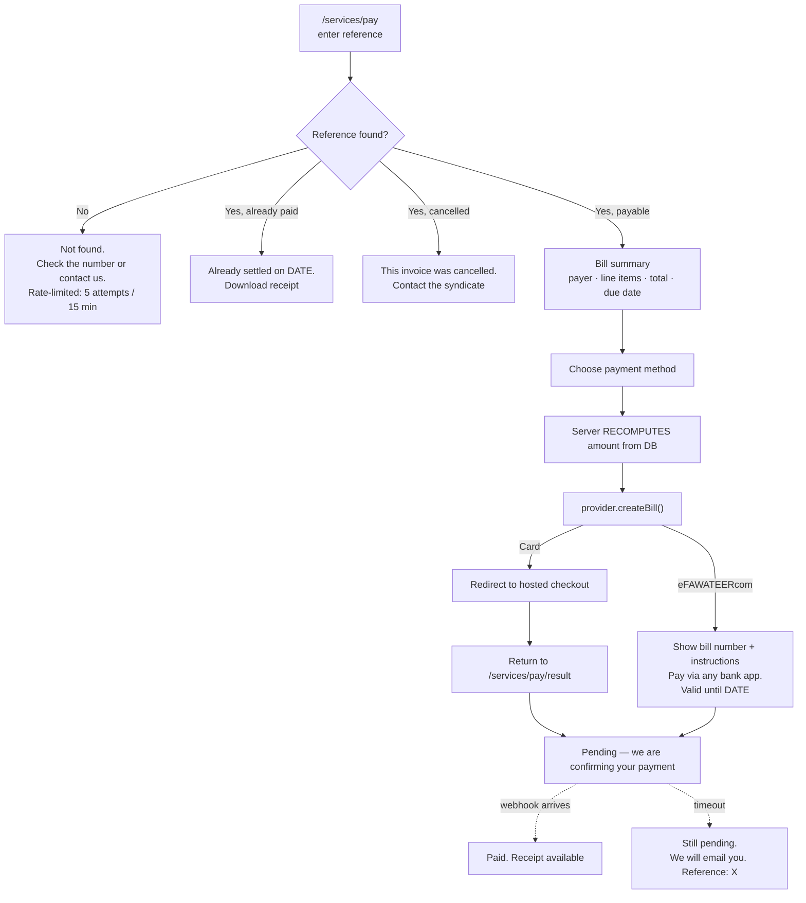
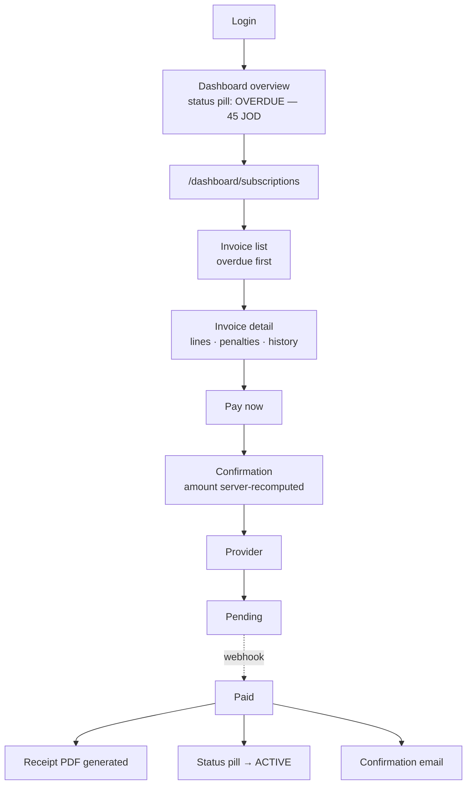
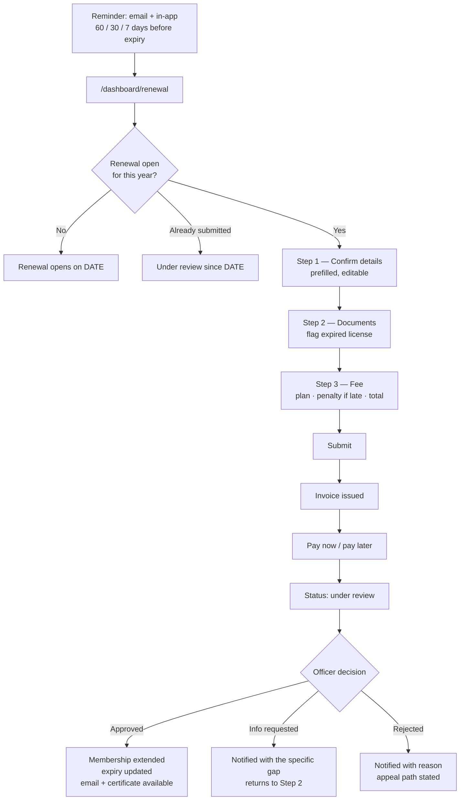
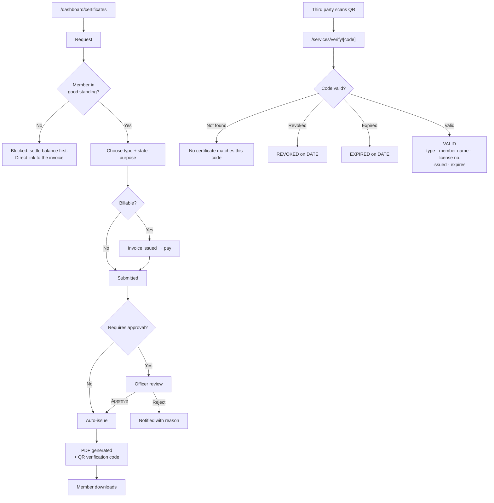
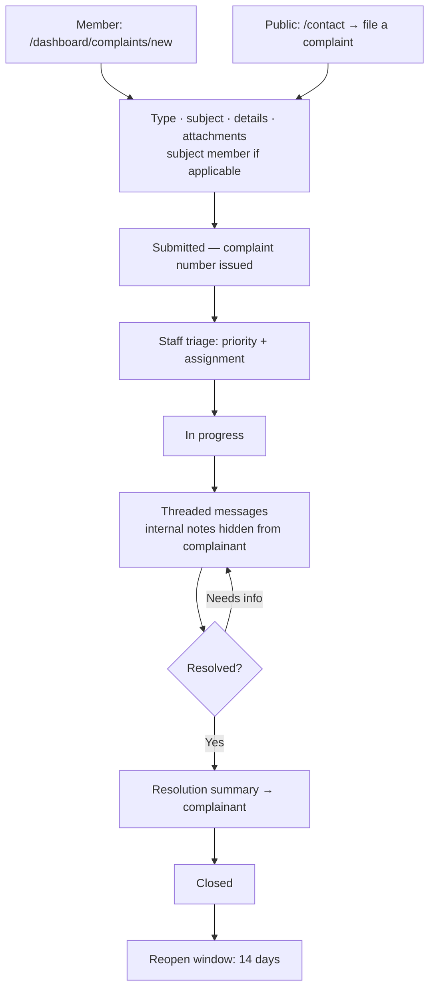
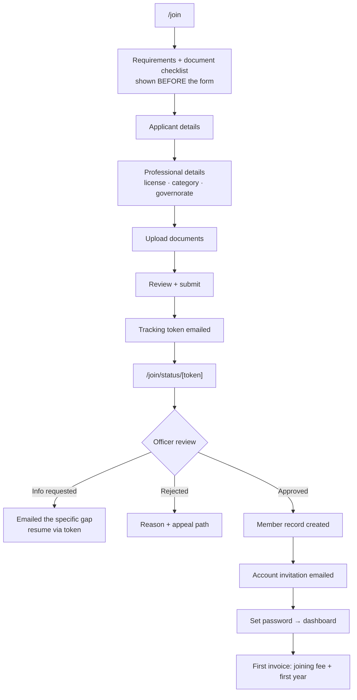
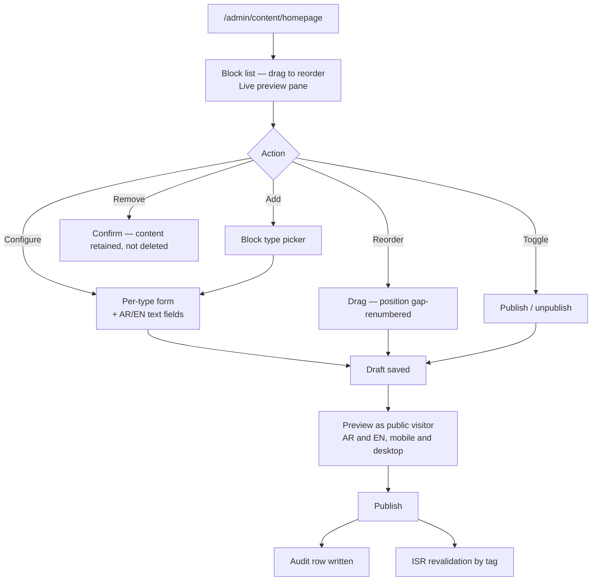
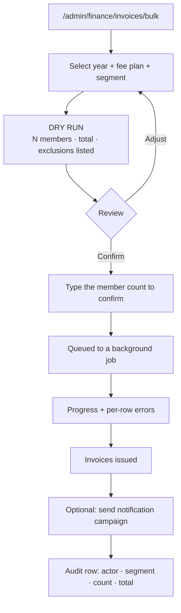
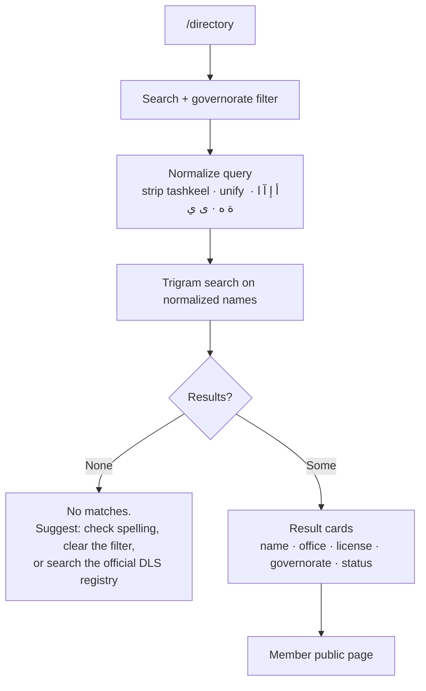

# 06 — UX Flows

The critical journeys, end to end. Each flow lists its entry points, states, error paths, and the decisions that matter.

---

## 1. Public bill payment (no account)

The highest-stakes public flow. A contractor or citizen was invoiced by the syndicate and holds only a reference number.

**Decisions:**

- **The reference is random, not sequential.** A sequential invoice reference would let anyone enumerate every bill in the system, including payer names and amounts. The `public_reference` on `invoices` is opaque.
- **Rate-limited lookup.** Five attempts per 15 minutes per IP. Without this the reference space is brute-forceable regardless of randomness.
- **The result page never asserts payment.** It says *pending* until the webhook confirms. A user returning from a provider redirect has not necessarily paid — the redirect is a UI hint, the webhook is truth. Telling someone they paid when they have not is worse than making them wait.
- **eFAWATEERcom is asynchronous by nature.** The user receives a bill number and goes to their banking app. The session ends. Payment may arrive minutes or days later. The flow must be complete and useful at the point the bill number is issued, with email confirmation afterward.
- **The bill summary shows line items, not just a total.** A payer who cannot see what they are paying for will call the syndicate instead of paying.

---

## 2. Member pays an outstanding subscription

**Decisions:**

- The **status pill is persistent** across every dashboard screen. A member's standing is the most consequential fact in their account; it should never require navigation to discover.
- **Overdue invoices sort first and always.** Not by date, not by amount.
- **Penalties appear as their own line item** with the rule that produced them stated in plain language. An unexplained surcharge generates a support ticket every time.
- A **suspended or expired member can still pay.** Gating payment behind good standing is the one restriction that makes the problem permanent.
- **Partial payment is supported** — `invoices.paid_fils` tracks it and the status becomes `partially_paid`. Members who cannot pay a full annual fee at once will otherwise pay nothing.

---

## 3. Annual renewal

**Decisions:**

- **Three steps, never more.** Each is independently savable — a member interrupted at step 2 does not restart.
- **Payment and approval are decoupled.** A member can submit, be reviewed, and pay separately. Coupling them means an unpaid renewal blocks review and a rejected renewal creates a refund. Both are worse.
- **"Info requested" states the specific gap** and returns the member directly to the relevant step. A generic "incomplete" forces a phone call.
- **Rejection always carries a reason and an appeal path.** This is a professional livelihood; an unexplained rejection is not acceptable from a regulatory body.
- Reminders at **60 / 30 / 7 days** and then on expiry. Every send is logged per-recipient, because a member disputing a late penalty will claim they were never told.

---

## 4. Certificate request → issuance → public verification

**Decisions:**

- **Good standing is required to obtain a certificate, and this is the correct gate** — unlike payment, a good-standing certificate for a member who is not in good standing would be a false statement by the syndicate.
- The **verification page shows the minimum**: validity, type, public name, license number, dates. It is a public endpoint reachable by anyone holding a code, so it must not expose contact details, financial state, or anything the member did not consent to publish.
- **Revoked and expired are distinguished.** "Expired" is routine; "revoked" is a signal a third party must not miss.
- Verification is **rate-limited** and codes are long and random, for the same enumeration reason as invoice references.
- The QR encodes the full verification URL, so any phone camera resolves it without an app.

---

## 5. Complaint filing and resolution

**Decisions:**

- **The public can file complaints** about a member — this is a core regulatory function of the syndicate and restricting it to members would defeat the purpose. Public complainants receive a tracking token by email rather than an account.
- **Internal staff notes are a first-class concept** (`complaint_messages.is_internal`). Staff will need to discuss a complaint; if the tool does not support that, they will do it over WhatsApp and the record will be lost.
- **A complaint number is issued immediately**, before triage. People need something to reference when they call.
- **A 14-day reopen window** after closure, so a premature close is recoverable without filing a duplicate.

---

## 6. Membership application (public → member)

**Decision:** the checklist appears **before** the form, not after. An applicant who reaches step 3 and discovers they need a document they do not have abandons and does not return.

---

## 7. Admin composes the homepage

**Decisions:**

- **Draft and published versions are separate.** An editor composing a homepage must not have half-finished work visible to the public. `layouts` carries both.
- **Preview covers both locales and both breakpoints.** An editor who only previews Arabic desktop will ship a broken English mobile homepage.
- **Removing a block does not delete its content.** It is unpublished. Editors will remove things by accident.
- **Publishing writes an audit row and triggers revalidation.** The public site updates within seconds, and there is a record of who changed the homepage and when.

---

## 8. Admin issues the annual invoice run

**Decisions:**

- **Dry run is mandatory, not optional.** This action issues hundreds of financial documents. It must be inspectable before it fires.
- **Typed confirmation of the member count**, not a checkbox. A checkbox is clicked reflexively; typing `412` requires reading.
- **Runs as a background job** with per-row error reporting. A single bad member record must not abort the run — it must be reported and skipped.
- **Notification is a separate, explicit step.** Issuing invoices and telling 400 people they owe money are different decisions and should not happen in one click.

---

## 9. Member directory search (public)

**Decisions:**

- **Query normalization is the whole flow.** Without it, a user typing `احمد` finds nothing while `أحمد` exists in the database. This is the single most common Arabic search failure and it makes a directory feel broken.
- **Only `active` members with `is_directory_visible` appear.** Suspension removes a member from the directory immediately — that is the point of suspension.
- **The empty state offers a route forward**, including a link to the official DLS registry. A dead end on a directory search sends the user to the phone.
- Results are **server-rendered and indexable.** The directory is the highest-value public SEO surface this system has.

---

## 10. Cross-cutting rules

**Every flow must define:** loading, empty, error, and success states. A flow specified only in its happy path is not specified.

**Error messages** state what happened, why, and what to do next. Never a bare status code, never "an error occurred."

**Destructive and financial actions** require confirmation naming the specific consequence: "Waive invoice ASOO-2026-000123 for 120.000 JOD?" — never "Are you sure?"

**Any action requiring a reason** (waive, suspend, reject, revoke) blocks submission until the reason is entered. The reason lands in the audit log.

**Mobile is co-primary.** Field surveyors work from phones. Every flow above is walked at 375px width before it is considered done.
