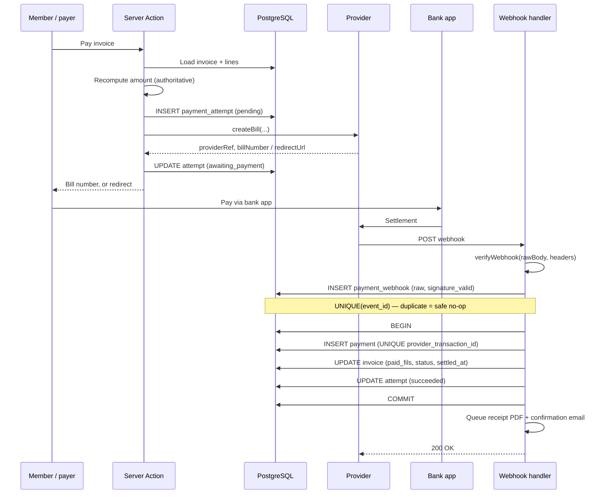

# 07 — Payments

## 1. Why an abstraction

The syndicate's eventual payment rail is **eFAWATEERcom**, Jordan's national e-bill presentment and payment network, operated by MadfooatCom. It is the rail Jordanians expect for official fees — members pay through their own bank's app, a wallet, or an agent.

Onboarding to eFAWATEERcom is a **bank-mediated commercial process**, not a self-serve API signup. The syndicate must be registered as a biller through its bank, which involves paperwork, approval, and a sandbox period. This is typically the longest-lead item in a project like this.

Development does not wait for it. Everything is written against a provider interface with a mock implementation; swapping in the real provider is a configuration change and one new class, not a rewrite.

---

## 2. The interface

```ts
// lib/payments/provider.ts

export interface PaymentProvider {
  readonly name: string

  /** Create a payable bill with the provider. Amount comes from the DB, never the client. */
  createBill(input: CreateBillInput): Promise<CreateBillResult>

  /** Query the provider for current status. Used by reconciliation, not by the UI. */
  getStatus(providerRef: string): Promise<ProviderPaymentStatus>

  /** Verify signature and parse. MUST be called before any parsing of the body. */
  verifyWebhook(rawBody: string, headers: Headers): Promise<VerifiedEvent>

  /** Optional — not every provider supports programmatic refunds. */
  refund?(input: RefundInput): Promise<RefundResult>
}

export interface CreateBillInput {
  invoiceId: string
  invoiceNumber: string
  amountFils: bigint          // integer fils, recomputed server-side
  currency: 'JOD'
  payerName: string
  payerEmail?: string
  payerPhone?: string
  description: string
  expiresAt: Date
  returnUrl: string           // where the payer lands after a redirect flow
}

export interface CreateBillResult {
  providerRef: string
  billNumber?: string         // eFAWATEERcom: what the payer enters in their bank app
  redirectUrl?: string        // card gateways: hosted checkout
  expiresAt: Date
}

export type ProviderPaymentStatus =
  | 'pending' | 'paid' | 'partially_paid' | 'failed' | 'expired' | 'cancelled'

export interface VerifiedEvent {
  eventId: string             // idempotency key — unique per provider event
  eventType: 'payment.succeeded' | 'payment.failed' | 'payment.expired' | 'payment.refunded'
  providerRef: string
  providerTransactionId: string
  amountFils: bigint
  paidAt?: Date
  raw: unknown                // persisted verbatim before processing
}
```

**Implementations**

| Class | Environment | Notes |
|---|---|---|
| `MockProvider` | local, dev | Deterministic outcomes keyed off the amount — see §7 |
| `EfawateercomProvider` | staging (sandbox), prod | Primary rail |
| `CardProvider` | optional second rail | HyperPay or MEPS; adds instant card payment and non-resident coverage |

Selected by the `PAYMENT_PROVIDER` environment variable. No application code references a provider class directly — everything goes through `getPaymentProvider()`.

---

## 3. Non-negotiable rules

1. **The invoice is the source of truth.** The provider reference hangs off the invoice, never the reverse. If provider state and local state disagree, reconciliation resolves it — the provider does not silently overwrite.

2. **The server always recomputes the amount** from `invoices` and `invoice_lines`. An amount arriving in a request body is untrusted noise. There is no code path where a client-supplied number becomes a charge.

3. **Verify the signature before parsing.** `verifyWebhook` receives the **raw body string**, not a parsed object. Parsing before verifying means processing attacker-controlled JSON.

4. **Persist the raw payload before any business logic.** `payment_webhooks` is written first, with `signature_valid` recorded. A processing bug then loses nothing — the message can be replayed.

5. **Idempotency is enforced by a database constraint**, not by application logic. `payment_webhooks.event_id` and `payments.provider_transaction_id` are both `UNIQUE`. A duplicate webhook hits the constraint and is safely discarded. Never rely on an in-memory check.

6. **The redirect is a hint; the webhook is truth.** A payer returning from a provider has not necessarily paid. The result page shows *pending* until the webhook lands.

7. **Credentials live in Google Secret Manager.** Never in `.env` in git, never in the client bundle, never in a log line.

8. **Payment state transitions follow a state machine.** Illegal transitions raise and alert — see §5.

9. **Never log a full card number, token, or credential.** Redaction happens at the logger, not at each call site.

---

## 4. Payment lifecycle



---

## 5. State machines

### Invoice
```
draft ──────► issued ──────► partially_paid ──────► paid
   │             │                  │
   │             ├──────► overdue ──┤
   │             │           │      │
   ├──► cancelled│           ▼      ▼
   └─────────────┴──────► waived   paid
```

Legal transitions only. `paid → issued` is impossible. `cancelled` and `waived` are terminal. Any attempt at an illegal transition throws and emits an alert — in a financial system, an unexpected transition is a bug or an attack, never a normal event.

### Payment attempt
```
pending ─► redirected ─► awaiting_payment ─► succeeded
   │            │                │
   └────────────┴────────────────┼─► failed
                                 ├─► expired
                                 └─► cancelled
```

`succeeded` is terminal and is set **only** by the webhook handler.

---

## 6. Reconciliation

A nightly Cloud Function compares local state against the provider's:

1. Pull provider transactions for the previous 48 hours (overlapping window, so nothing falls between runs).
2. For each, find the matching `payments` row by `provider_transaction_id`.
3. Classify every divergence:

| Divergence | Meaning | Action |
|---|---|---|
| Provider paid, no local payment | **Missed webhook** | Create the payment, settle the invoice, alert |
| Local paid, provider has no record | **Data integrity failure** | Alert immediately — do not auto-correct |
| Amount mismatch | Partial payment or a bug | Flag for a finance officer |
| Provider paid twice for one invoice | Duplicate settlement | Flag; likely refund |

4. Mark reconciled rows with `reconciled_at`.
5. Emit a summary; **any divergence triggers an alert**, not just a log line.

An unreconciled payment older than 72 hours escalates. Missed webhooks are not exotic — providers retry, networks fail, deploys drop requests. Reconciliation is what makes that survivable.

---

## 7. MockProvider

Deterministic behavior keyed off the last three digits of the amount in fils, so any scenario is reproducible in a test or a manual walkthrough:

| Amount ends in | Behavior |
|---|---|
| `000` | Succeeds immediately (webhook fires after ~2s) |
| `001` | Succeeds after a 30s delay — tests the pending UI |
| `002` | Fails with `insufficient_funds` |
| `003` | Expires without payment |
| `004` | Succeeds, then fires a **duplicate** webhook — tests idempotency |
| `005` | Fires a webhook with an **invalid signature** — tests rejection |
| `006` | Partial payment (half the amount) |
| `007` | Webhook never arrives — tests reconciliation recovery |

Every one of these paths is covered by an automated test. The idempotency and invalid-signature cases in particular must be tested, because in production they are the ones that only appear under attack or provider malfunction.

---

## 8. eFAWATEERcom specifics

Recorded here for the integration phase; details confirm during onboarding.

- **Model:** biller presentment. The syndicate registers as a biller with a biller code; each invoice becomes a *bill* the payer settles through any participating channel.
- **Channels:** every Jordanian bank's app and internet banking, e-wallets, and physical agents. Reach is effectively universal, which is why this is the right rail.
- **Asynchronous by design.** The payer leaves the site to pay elsewhere. The UI must be complete and useful at the point the bill number is issued — do not design a flow that assumes the user stays.
- **Bill expiry** is set at creation. Expired bills need reissue, so the bill number shown to the member must display its validity date prominently.
- **Settlement is T+1 or later.** The webhook confirms the payment; funds arrive later. `payments.paid_at` records when the payer paid, not when funds cleared. Do not conflate them in financial reports.
- **Sandbox first.** All eight MockProvider scenarios are re-run against the sandbox before production credentials are requested.

**Onboarding checklist (syndicate side, start now):**
- [ ] Bank relationship confirmed and biller application submitted
- [ ] Biller code assigned
- [ ] Sandbox credentials issued
- [ ] Settlement account confirmed
- [ ] Fee structure and per-transaction cost agreed
- [ ] Production credentials issued after sandbox sign-off

---

## 9. Manual payments

Members will continue to pay in cash and by bank transfer at the syndicate office. This is not an edge case — it will be a meaningful share of revenue for years.

A finance officer records these against an invoice with `channel = cash | bank_transfer`, `recorded_by` set to their user, and a mandatory reference field (receipt book number or bank transfer reference). The action writes an audit row like any other financial mutation.

Manual payments are excluded from provider reconciliation by `channel` — otherwise every cash payment would appear as a "local paid, provider has no record" divergence and drown the real signal.

---

## 10. Testing requirements

Before the real provider goes live:

- [ ] All eight MockProvider scenarios pass automatically
- [ ] Duplicate webhook delivery creates exactly one payment row
- [ ] Invalid signature is rejected, logged, and alerted — and creates no payment
- [ ] Concurrent payment attempts on one invoice do not double-settle it
- [ ] Reconciliation correctly identifies each of the four divergence classes
- [ ] Illegal state transitions throw rather than silently succeeding
- [ ] No amount anywhere in the codebase is a float — verified by grep and by type
- [ ] Payment flow is walked end to end in Arabic RTL on a 375px viewport
- [ ] Partial payment leaves the invoice in `partially_paid` with a correct remaining balance
- [ ] The receipt PDF renders correctly in Arabic with the amount in Western digits
