# 10 — Delivery Roadmap

Seven phases. Each ends with something demonstrable — no phase produces only internal scaffolding.

---

## Phase 0 — Foundation ✅ *(this phase)*

Documentation, schema, design tokens, and the agent operating manual. **No application code.**

**Delivered:** `CLAUDE.md` · `docs/01`–`docs/10` · `dataconnect/schema/schema.gql` · `design/tokens.json` · `design/content-inventory.md`

**Exit criteria**
- [ ] Schema parses and the generated SQL is reviewed by the SQL developer
- [ ] Token build emits CSS + Tailwind theme; all contrast pairs pass AA
- [ ] IA reviewed against the crawled prototype — no page dropped without a redirect
- [ ] Every selected member and admin capability traces to a story, a route, and a table
- [ ] Syndicate signs off on `01-prd.md` and `04-site-architecture.md`

---

## Phase 1 — Shell and public site ✅ *(built, pending cloud provisioning)*

**Delivered:** Next.js 15 App Router app, AR/EN locale routing with RTL-primary shell, the "Datum" design system generated from `design/tokens.json` with a build-time WCAG gate, Framer Motion vocabulary, nine CMS block types behind a `BlockRenderer`, and every public page rendering from a `ContentRepository` interface — seed-backed today, Data Connect in Phase 2 with no page-code change.

**Verified:** typecheck and lint clean, `npm audit` clean, production build prerenders both locales, 22 routes serving, prototype URLs 301'd, Arabic search normalisation confirmed (`احمد` matches `أحمد`), suspended members excluded from the directory, no horizontal overflow at 375px.

**Still outstanding in this phase:** Firebase project provisioning and deployment, which is blocked on the cloud-region decision (Q1), and the real brand identity (Q6) — the current palette is a considered proposal, not the syndicate's confirmed identity.

- Next.js App Router skeleton, TypeScript strict, ESLint rules that enforce §10 of the design system
- i18n routing, locale negotiation, AR/EN dictionaries, RTL shell
- Design system implemented from tokens; shadcn primitives audited for RTL
- Firebase projects provisioned (dev/staging/prod), App Hosting configured
- Data Connect schema deployed, emulator suite working locally
- Seed data loaded
- Public pages rendering from the database: home (blocks), about, news, documents, maps, contact
- `robots.txt`, `sitemap.xml`, hreflang, structured data
- 301 redirects from the prototype's URLs

**Demo:** the current site, rebuilt, bilingual, database-driven, and faster.

---

## Phase 2 — Identity, members, and the CMS *(in progress)*

**Done so far:**

- **Authorization spine.** `lib/auth/roles.ts` implements the permission matrix from `docs/08-security.md` §4. Three layers are now real: middleware gates the route, the page re-checks the specific permission, and the server action checks again before mutating. Verified by role — `support_agent` and `finance_officer` are redirected away from the CMS, `content_editor` is admitted.
- **Mock auth hardened.** Previously an unauthenticated `POST /api/auth/mock-login {"role":"super_admin"}` granted full admin in the production build. Now double-gated and refused in three independent places. See `docs/08-security.md` §10a.
- **Audited mutations.** `lib/audit/withAudit()` wraps every admin write, enforcing CLAUDE.md §2 #5. Actions requiring a stated reason (waive, suspend, revoke, refund) are refused without one. The `/admin/audit` viewer is live, `super_admin` only, and append-only by construction.
- **CMS rewritten** against server actions: news manager and homepage composer, both fully translated, with confirmation dialogs that name the specific consequence rather than asking "are you sure?".
- **Standards debt cleared.** 146 hardcoded strings → 0. An undefined design token that silently rendered as no style across 8 files, fixed. Two new CI gates (`npm run audit:i18n`, `npm run audit:tokens`) prevent both classes of regression.

**Known gap — the CMS does not yet drive the public site.** Admin writes go to
`lib/data/store.ts`; the public pages still read `lib/data/seed.ts`. The two hold
different shapes — the demo store carries flat single-language text, the seed
carries per-locale objects. Bridging them with an adapter would be a bodge, so
they stay separate until the Data Connect implementation of `ContentRepository`
replaces both. Until then `revalidatePath` in the actions is a no-op.

**Member dashboard — built and verified.** The complete member area now exists
under `/[locale]/dashboard`, gated to the `member` role:

- **Overview** — persistent status pill (overdue overrides active), outstanding
  balance, next renewal, recent invoices, quick actions.
- **Subscriptions & invoices** — overdue-first ordering; **invoice detail** with
  line items, a stated penalty rule, and a pay flow whose confirmation names the
  exact amount and invoice and whose result is *pending*, never *paid* — only a
  webhook confirms payment (docs/06-ux-flows.md §1). The pay action recomputes
  the amount server-side and writes a `payment.attempt` audit row.
- **Profile** — directory-consent state, separately-published contact set.
- **Renewal** — three-step indicator, flows RTL in Arabic.
- **Certificates** — good-standing gate: a member with an overdue balance is
  shown why they cannot request one, not a dead button.
- **Complaints** — list + threaded conversation with staff.
- **Notifications** — mark-all-read.

**Admin member management — built and verified.** `membership_officer` screen
with Arabic-normalised search, status filter, and a suspend flow that **refuses
to submit without a reason** — the reason lands in the audit log and the member
leaves the public directory immediately. Reactivate reverses it. Verified end to
end: a suspend by `membership_officer` and a `payment.attempt` by `member` both
appear in the `super_admin`-only audit log with actor-role snapshots and the
stated reason.

All verified in the browser on **localhost:3001**, both locales, with every gate
green (contrast · token existence · i18n · typecheck · lint), a clean production
build, and `npm audit` clean.

### Remaining in this phase

- Firebase Auth: email, phone OTP, staff MFA
- Roles as custom claims, mirrored to Postgres; middleware route gating
- Member records, profile editing, document upload to the private bucket
- Public member directory with **Arabic-normalized** search and governorate filtering
- Member public pages
- Membership application flow with tracking token
- Admin: member management, application queue
- **Admin CMS:** news, pages, documents, links, media library
- **Admin: homepage block composer** with draft/publish and dual-locale preview
- Audit log wrapper and viewer
- Member data import: quarantine table, validation, exceptions report

**Demo:** staff run the website themselves; the public can find and verify a surveyor.

**Blocked by:** Q3 — the form existing member records are in.

---

## Phase 3 — Money

**Depends on:** fee structure confirmed (Q2)

- Fee plans, date-versioned
- Invoice model, line items, invoice number sequence, random public references
- `PaymentProvider` interface and `MockProvider` with all eight scenarios
- Member: view invoices, pay, payment history, receipt PDF
- Public: pay a bill by reference, no account
- Webhook handler: signature verification, raw persistence, idempotency, transactional settlement
- Admin: issue invoices, bulk run with mandatory dry run, waive with reason, record manual payments
- Reconciliation job and divergence alerting
- Financial reports and export

**Demo:** end-to-end payment against the mock provider, including duplicate-webhook and missed-webhook recovery.

**This is the highest-risk phase.** Budget for it accordingly and do not compress it.

---

## Phase 4 — Member services

**Depends on:** certificate signing requirements confirmed (Q4)

- Annual renewal: three-step flow, invoice generation, officer review, approval
- Renewal reminders at 60/30/7 days and on expiry
- Certificate types, request flow, approval, PDF generation with QR
- **Public certificate verification** endpoint, rate-limited
- Complaints: filing by members and the public, triage, assignment, threaded messages with internal notes, resolution
- Admin queues for renewals, certificates, and complaints

**Demo:** a member renews, requests a good-standing certificate, and a third party verifies it by scanning the QR.

---

## Phase 5 — Real payments and communication

**Depends on:** eFAWATEERcom biller onboarding complete; SMS aggregator contracted (Q5)

- `EfawateercomProvider` implemented and run against sandbox
- All eight mock scenarios re-verified against the sandbox
- Production credentials, live cutover with `MockProvider` retained as a rollback path
- Optional card gateway as a second rail
- Notification templates and delivery (email + SMS), per-recipient logging
- Bulk campaigns with segment filtering
- Member notification centre

**Demo:** a real payment through a real Jordanian bank app settles a real invoice.

---

## Phase 6 — Hardening and launch

- Full accessibility audit including **Arabic screen-reader testing** of payment, renewal, and certificate flows
- Load testing at expected peak — the annual renewal window is the spike, and it is sharp
- Internal security review against the `docs/08-security.md` checklist
- **Third-party penetration test**, findings closed before launch
- Backup restore drill, executed and documented
- Runbooks: incident response, reconciliation divergence, failed invoice run, provider outage
- **Staff training and handover documentation** — the syndicate must be able to operate this without the build team
- Privacy policy, terms, and accessibility statement published and accurate
- Soft launch to a pilot member group, then general availability

---

## Critical path

```mermaid
gantt
    dateFormat X
    axisFormat %s
    title Dependencies (relative units, not calendar dates)

    section Blocking (start now)
    Cloud region decision (Q1)     :crit, q1, 0, 1
    eFAWATEERcom onboarding        :crit, ef, 0, 5
    Brand assets (Q6)              :q6, 0, 1
    Fee structure (Q2)             :q2, 0, 2
    Member data discovery (Q3)     :q3, 0, 2

    section Build
    P1 Shell + public              :p1, after q1, 2
    P2 Auth + members + CMS        :p2, after p1, 3
    P3 Money (mock)                :crit, p3, after p2, 3
    P4 Member services             :p4, after p3, 2
    P5 Real payments + comms       :crit, p5, after ef, 2
    P6 Hardening + launch          :p6, after p5, 2
```

**The two things that will actually delay this project:**

1. **eFAWATEERcom onboarding.** It is external, bank-mediated, and not under the build team's control. It must start on day one. The provider abstraction means Phases 1–4 proceed regardless, but Phase 5 cannot start until it completes.
2. **The cloud region decision.** It blocks all provisioning and it is immutable once made. Nothing in Phase 1 can be deployed until it is answered.

Neither is a technical problem. Both are decisions someone at the syndicate has to make, and the sooner they are asked, the shorter this project is.

---

## Open questions, by blocking phase

| # | Question | Owner | Blocks |
|---|---|---|---|
| Q1 | Which cloud region is legally acceptable? | Syndicate legal/IT | **Phase 1** |
| Q6 | Official logo, brand colors, visual identity? | Syndicate | **Phase 1** |
| Q3 | What form do existing member records take? | Membership office | Phase 2 |
| Q2 | Fee amounts, categories, penalties, proration? | Finance committee | Phase 3 |
| Q4 | Which certificates need a physical seal or board signature? | Syndicate board | Phase 4 |
| Q5 | Which SMS aggregator? | Syndicate admin | Phase 5 |
| Q7 | Actual document files — Law 43/1972, Reg. 105/1999, 2025 tariff, forms | Syndicate | Phase 1 seed |

---

## Definition of launch-ready

- [ ] All Phase 6 items complete
- [ ] Penetration test findings closed
- [ ] Backup restore drill passed
- [ ] Staff trained; runbooks handed over
- [ ] Real payment settled end to end in production
- [ ] Accessibility statement published and true
- [ ] Rollback plan documented and rehearsed
